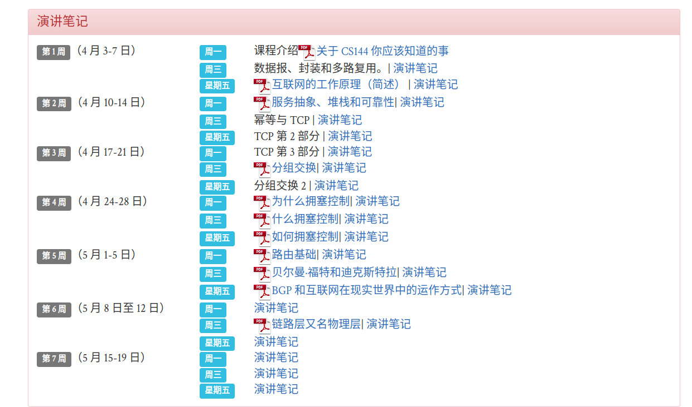

# 学习计划评估

TCP连接学习

https://cs144.github.io/

记录工时

禅道

https://www.zentao.net/book/zentaopms/38.html

需要对花费时间进行评估

即

要做哪些事情

事情有哪些环节，做到什么程度算是做好了。

需要多少时间。

## 评估

- 需求

需要对这个过程有深入的理解

后续如果要面试，这个环节避开不了，公司里的安全离不开这个环节。

- 可行性

  英语可以通过页面的整体翻译来进行。

  代码环境都可以

  代码写到github上。

  需要输出文档到博客上。

- 计划

  这里面的课程都是50分钟

  作业的话花费不知道怎么评估。

  总共21节课，

  每节课需要花费50分钟在阅读文档上，理解题意上，大约一天的时间在实验上。

  

| 项目                              |    时间     |          详情 |
| :-------------------------------- | :---------: | ------------: |
| 关于CS144你应该知道的事情         |  20230527   | right-aligned |
| 数据包,封装和多路复用             |  20230528   |        右对齐 |
| 互联网的工作原理                  | 20230603/04 |               |
| 服务抽象，堆栈和可靠性            |  20230610   |               |
| 幂等与 TCP                        |  20230611   |               |
| TCP第二部分                       |  20230617   |               |
| TCP第三部分                       |  20230618   |               |
| 分组交换                          |  20230622   |               |
| 分组交换２                        |  20230623   |               |
| 为什么拥塞控制                    |  20230624   |               |
| 什么拥塞控制                      | 20230701/02 |               |
| 如何拥塞控制                      |  20230708   |               |
| 路由基础                          |  20230709   |               |
| 贝尔曼.福特和迪克斯特拉           |  20230715   |               |
| BGP和互联网在现实世界中的运作方式 |  20230716   |               |
| 演讲笔记                          |  20230722   |               |
| 链路层又名物理层                  |  20230723   |               |
| 演讲笔记                          |  20230729   |               |

